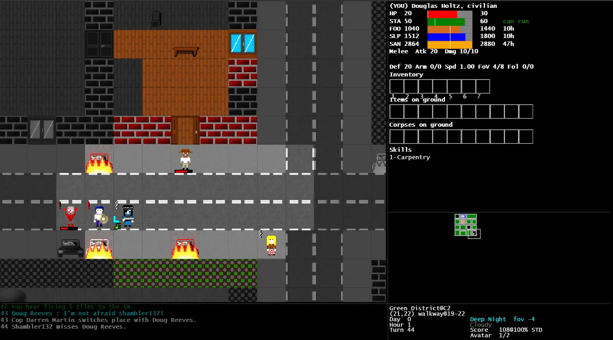

# Rogue Survivor: Reloaded

A browser-playable TypeScript port of **Rogue Survivor** by [Jacques Ruiz (roguedjack)](http://roguesurvivor.blogspot.com/), whose original 2012 C#/Windows Forms source can be found [here](https://github.com/roguedjack/Rogue-Survivor-Alpha-9) and was used as the reference for every line of the port (version 10.1).

The game is a turn-based, real-time survival roguelike: you play a survivor (or an undead) in a procedurally generated city, scavenging while the district behind you floods with the dead. Survive the nights.

**Website**: the manual, controls and project notes live in [`docs/`](docs/), and are
published with GitHub Pages as the landing page of the same site the game is served
from — the game is at `/game/`. See [`docs/README.md`](docs/README.md) for the site
conventions and [`web/README.md`](web/README.md#deploying) for how the site is built.

## Why This Port?

Basically, I love the original game but it is quite dated in its infrastructure. The fonts are tiny in bigger screens, and they stretch and become blurry. Maintenance is hard as it has "god files", code files with 250,000 lines (!) and 1 MB in size, for example.

I also hate C# :( and Typescript makes it run on more systems natively, and enables the game to be played on browser and (in the future, maybe) on mobile.

For now, the game will be as close to a 1:1 port as possible; the only changes will be QOL ones, like adding zoom, larger and more readable text on the UI and menus, and so forth. I plan to add more content in the future but will always keep a legacy version available for the true original experience. with only these QOL fixes.

Feel free to submit PRs/suggestions!

> [!NOTE]
> See the [web port README](./web/README.md) for setup, architecture, and technical project overview.

## Running the Game

If you're only interested in running the game (not developing), download the latest release from the [Releases page](https://github.com/taislin/Rogue-Survivor-Reloaded/releases/latest). This is ready to run out of the box for Windows, Linux and MacOS. For development instructions, including how to run from the source code, check the [web port README](./web/README.md) (requires NodeJS).

## License

GPLv3, inherited from the original project — see [`LICENSE.txt`](LICENSE.txt).

The original game and source are by Jacques Ruiz (roguedjack). This repository
is a port of that work and is covered by the same license.
