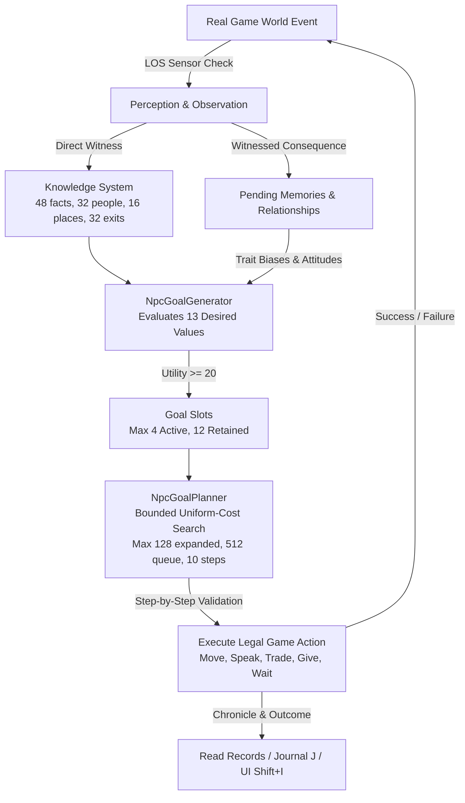
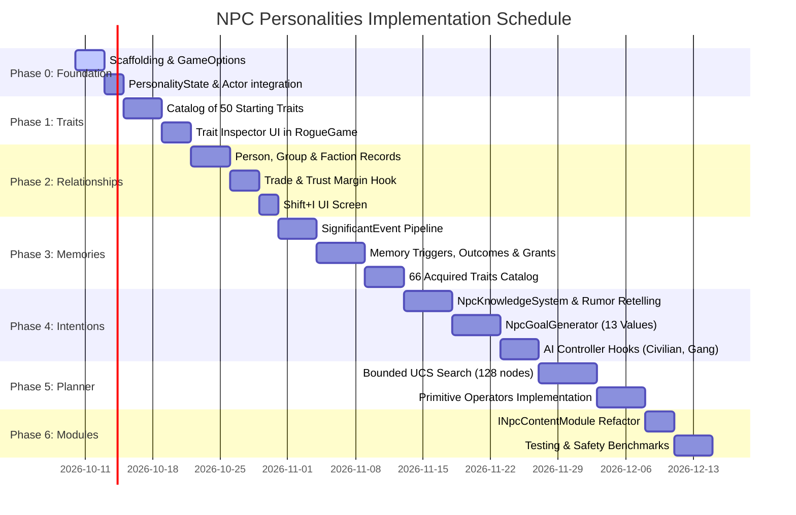

# NPC Traits & Personalities — Comprehensive Master Implementation Plan

> **Source Documents** (from `https://github.com/Qew7/Rogue-Survivor-Expanded/tree/master/docs`):
> - `npc-traits-guide.md` — Catalog of all 116 traits (50 starting, 66 acquired), decision axes, conflict pairs
> - `npc-personality.md` — Core personality architecture, relationships, memory definitions, triggers & outcomes
> - `npc-intentions.md` — Goal generator, 13 desired values, planner algorithms & limits, Story Director, group succession
> - `npc-content-modules.md` — Extensibility architecture, `INpcContentModule`, catalog builder
> - `npc-social-stories.md` — Social mechanics, promises, resource contention, medical aid, item/place attachments
> - `npc-safety-experiment.md` — Headless benchmarks, escape planning, retreat behavior under stress
> - `save-structure.md` & `save-format.md` — Save graph footprint, avoiding Actor references, serialization bounds
> 
> **Target Codebase**: Rogue Survivor Reloaded (`d:\GitHub\Rogue-Survivor-Reloaded`)  
> **Status**: Comprehensive Master Plan — No code written yet.

---

## Table of Contents

1. [Executive Summary & High-Level Architecture](#1-executive-summary--high-level-architecture)
2. [The 8 Decision Axes (Tendencies)](#2-the-8-decision-axes-tendencies)
3. [The Complete 116-Trait Catalog](#3-the-complete-116-trait-catalog)
   - [3.1 Starting Traits (50)](#31-starting-traits-50)
   - [3.2 The 10 Mutually Exclusive Starting Pairs](#32-the-10-mutually-exclusive-starting-pairs)
   - [3.3 Core Acquired Traits (24)](#33-core-acquired-traits-24)
   - [3.4 Unique Character Encounter Traits (9)](#34-unique-character-encounter-traits-9)
   - [3.5 Faction Relationship Acquired Traits (18)](#35-faction-relationship-acquired-traits-18)
   - [3.6 World Event Acquired Traits (15)](#36-world-event-acquired-traits-15)
4. [Data Structures & Containers](#4-data-structures--containers)
   - [4.1 `PersonalityState` Class](#41-personalitystate-class)
   - [4.2 Actor Identity & Life-Cycle Management](#42-actor-identity--life-cycle-management)
5. [Relationship System](#5-relationship-system)
   - [5.1 Three Relationship Tiers](#51-three-relationship-tiers)
   - [5.2 Feeling Formula & Component Scores](#52-feeling-formula--component-scores)
   - [5.3 Interactions with `TrustInLeader` and Trade](#53-interactions-with-trustinleader-and-trade)
   - [5.4 Faction Policy Matrix](#54-faction-policy-matrix)
6. [Events, Memories & Journaling](#6-events-memories--journaling)
   - [6.1 `SignificantEvent` Kinds & Delivery](#61-significantevent-kinds--delivery)
   - [6.2 `MemoryDefinition`, Triggers & Outcomes](#62-memorydefinition-triggers--outcomes)
   - [6.3 Delayed Skill & Trait Grants](#63-delayed-skill--trait-grants)
   - [6.4 Bounded Journal & Evidence Retention Rules](#64-bounded-journal--evidence-retention-rules)
7. [Knowledge System & Information Flow](#7-knowledge-system--information-flow)
   - [7.1 Facts & Perceptions](#71-facts--perceptions)
   - [7.2 Conversations, Rumors & Retelling Degradation](#72-conversations-rumors--retelling-degradation)
   - [7.3 Hard Knowledge Capacity Limits](#73-hard-knowledge-capacity-limits)
8. [Goal Generation (`NpcGoalGenerator`)](#8-goal-generation-npcgoalgenerator)
   - [8.1 Integer Utility Formula](#81-integer-utility-formula)
   - [8.2 The 13 Desired States (Values) & Importance Weights](#82-the-13-desired-states-values--importance-weights)
   - [8.3 Intentions Table (Formulas, Deadlines & Cooldowns)](#83-intentions-table-formulas-deadlines--cooldowns)
   - [8.4 Intention Slots & Lifecycle](#84-intention-slots--lifecycle)
9. [Action Planning & Execution (`NpcGoalPlanner`)](#9-action-planning--execution-npcgoalplanner)
   - [9.1 Bounded Uniform-Cost Search (UCS)](#91-bounded-uniform-cost-search-ucs)
   - [9.2 Facts, Operators & Cost Biases](#92-facts-operators--cost-biases)
   - [9.3 Concrete Execution Rules (Food, Barter, Medicine, Departure)](#93-concrete-execution-rules-food-barter-medicine-departure)
10. [Social Interactions, Stories & The Director](#10-social-interactions-stories--the-director)
    - [10.1 Spoken Promises & Boundary Management](#101-spoken-promises--boundary-management)
    - [10.2 Resource Contention & Claim Disputes](#102-resource-contention--claim-disputes)
    - [10.3 Attachments (People, Items & Places)](#103-attachments-people-items--places)
    - [10.4 Group Succession & Preserving Identity](#104-group-succession--preserving-identity)
    - [10.5 Session Story Director Limits & Pacing](#105-session-story-director-limits--pacing)
11. [Content Modules & Extensibility Architecture](#11-content-modules--extensibility-architecture)
12. [Gap Analysis & Integration into Reloaded](#12-gap-analysis--integration-into-reloaded)
13. [Phased Implementation Roadmap](#13-phased-implementation-roadmap)
14. [Performance & Save Serialization Safety](#14-performance--save-serialization-safety)
15. [Deterministic Test & Benchmark Baseline](#15-deterministic-test--benchmark-baseline)

---

## 1. Executive Summary & High-Level Architecture

The NPC Traits and Personalities system replaces the simplistic, reactive, hardcoded AI scripts in Rogue Survivor with an **emergent, belief-driven cognitive loop**:



### Core Design Invariants
1. **Zero Hallucination / Perfect Knowledge Isolation**: NPCs never inspect global world arrays, town populations, or unseen inventories. All planning operates strictly on personal, time-stamped belief snapshots.
2. **Authoritative Engine Preservation**: Existing combat mechanics, survival hunger/thirst/sleep clocks, line of fire, and explicit leader orders remain authoritative. Personal goals pause or abort when survival or combat imperatives intervene.
3. **Save Graph Isolation**: Relationships and memories never hold direct `Actor` or `Map` object references. Identifiers use 32-bit spawn timestamps, founder IDs, or stable string tokens.
4. **Complete Option Gating**: Gated behind `GameOptions.NpcPersonalities`. When false, performance overhead is nil and behavior is 100% vanilla.

---

## 2. The 8 Decision Axes (Tendencies)

Trait effects shift an NPC's baseline tendencies. Effects sum across active traits and are clamped to `[-100, +100]`. They are not flat percentage chances or stat bonuses—they modulate heuristic utility calculations and planning action costs.

| Index | Tendency | What it Modulates |
|:---:|---|---|
| **0** | **Items** | Perceived utility of discovered ground loot; priority given to item recovery and trade value. |
| **1** | **Courage** | Willingness to engage threats, threshold for retreating vs fleeing, confrontation vs avoidance. |
| **2** | **Group** | Trust acquisition velocity with leaders, loyalty, willingness to accept tasks or follow proposals. |
| **3** | **Law** | Adherence to social contracts, intolerance of murder/theft, pursuit of restitution, boundary defense. |
| **4** | **Trade** | Propensity to offer barter, tolerance of marginal exchange ratios, preference for commerce over charity. |
| **5** | **Exploration** | Drive to use district/building exits, investigate unmapped zones, wander vs stay in shelter. |
| **6** | **Compassion** | Drive to provide medical treatment, share food reserves, aid companions, and avenge victims. |
| **7** | **Supplies** | Hoarding value of food, medicine, and ammo; drive to secure personal reserves before helping others. |

---

## 3. The Complete 116-Trait Catalog

### 3.1 Starting Traits (50)
At character generation, every living intelligent NPC receives **3 distinct starting traits**.

| # | Name | String ID | Tendency Modifiers | Unique Gameplay Emotes & Behaviors |
|:---:|---|---|---|---|
| 1 | Kind | `kind` | Compassion +25, Group +5 | Speaks warm acknowledgements when aided. |
| 2 | Cruel | `cruel` | Compassion −25, Courage +8 | May boast about violence and cruelty. |
| 3 | Law-abiding | `lawful` | Law +25, Group +5 | Respects property boundaries; pursues killers. |
| 4 | Rebellious | `rebellious` | Law −20, Group −5 | May boast about theft and violence; ignores base claims. |
| 5 | Brave | `brave` | Courage +25, Exploration +8 | Low retreat threshold; confronts threats directly. |
| 6 | Timid | `timid` | Courage −25, Exploration −8 | Panics easily; high retreat propensity. |
| 7 | Sociable | `sociable` | Group +25, Trade +5 | Rapid leader trust growth; initiates dialogue. |
| 8 | Solitary | `solitary` | Group −25, Exploration +5 | Decays leader trust over time; terse acknowledgements. |
| 9 | Loyal | `loyal` | Group +20, Compassion +8 | High tolerance for leader adversity; protects companions. |
| 10 | Independent | `independent` | Group −15, Courage +5 | Readily splits or leaves incompetent leaders. |
| 11 | Generous | `generous` | Trade +20, Compassion +10 | Readily gives food/medicine; accepts marginal trade. |
| 12 | Selfish | `selfish` | Trade −20, Compassion −10 | Hoards food; snide acknowledgements ("About time."). |
| 13 | Frugal | `frugal` | Supplies +20, Trade −5 | Maintains deep personal reserves before gifting. |
| 14 | Impulsive | `impulsive` | Courage +10, Supplies −8 | Quick to expend ammunition and rush forward. |
| 15 | Patient | `patient` | Courage −5, Law +5 | Waits at defensive positions; deliberate replies. |
| 16 | Vigilant | `vigilant` | Courage −8, Supplies +10 | High suspicion of unverified sounds; guards caches. |
| 17 | Careless | `careless` | Courage +8, Supplies −10 | Neglects supply monitoring; overextends. |
| 18 | Curious | `curious` | Exploration +25, Items +5 | Frequently visits unmapped tiles and exits. |
| 19 | Cautious | `cautious` | Courage −15, Exploration −5 | Avoids unlit rooms and unknown building entries. |
| 20 | Ambitious | `ambitious` | Group +10, Exploration +10 | Ranks high in group succession voting. |
| 21 | Humble | `humble` | Group +5, Trade +5 | Yields disputed resources easily upon request. |
| 22 | Honest | `honest` | Law +15, Trade +8 | Follows through on verbal promises; reports accurately. |
| 23 | Deceptive | `deceptive` | Law −15, Trade −8 | Stolen supplies excuse: claims taking was permitted. |
| 24 | Trusting | `trusting` | Group +15, Compassion +8 | Readily believes rumors and unverified hearsay. |
| 25 | Suspicious | `suspicious` | Group −15, Courage −5 | Rejects hearsay; requires direct LOS verification. |
| 26 | Protective | `protective` | Compassion +20, Courage +12 | Steps into melee to defend wounded companions. |
| 27 | Vindictive | `vindictive` | Courage +15, Law −5 | Never forgets debt/grievance; seeks retaliation. |
| 28 | Forgiving | `forgiving` | Compassion +15, Courage −5 | Rapid grievance decay; accepts apologies easily. |
| 29 | Organized | `organized` | Supplies +15, Group +5 | Maintains tidy base storage; effective leader. |
| 30 | Messy | `messy` | Supplies −12, Group −3 | Drops items haphazardly; poor base hygiene. |
| 31 | Hoarder | `hoarder` | Items +15, Supplies +12 | Picks up and retains useless trinkets and tools. |
| 32 | Minimalist | `minimalist` | Items −10, Supplies −5 | Carries only essential weapons, food, and medicine. |
| 33 | Healer at heart | `healer` | Compassion +20, Supplies +8 | Prioritizes acquiring and applying medical aid to others. |
| 34 | Scavenger | `scavenger` | Items +12, Exploration +12 | Scours ruins and basements for discarded supplies. |
| 35 | Homebody | `homebody` | Exploration −20, Group +8 | Strongly resists leaving designated shelter / base. |
| 36 | Wanderer | `wanderer` | Exploration +20, Group −5 | Restless; frequently migrates between districts. |
| 37 | Peacemaker | `peacemaker` | Courage −12, Compassion +12 | Attempts to de-escalate disputes; warns before fighting. |
| 38 | Hotheaded | `hotheaded` | Courage +20, Law −5 | Aggressive escalation upon refusal or minor threats. |
| 39 | Pragmatic | `pragmatic` | Supplies +12, Compassion −5 | Willing to make harsh survival trade-offs. |
| 40 | Idealist | `idealist` | Law +12, Compassion +12 | Prioritizes community justice over cold survival. |
| 41 | Thrill seeker | `thrillseeker` | Courage +15, Exploration +15 | Drawn to sounds of combat and dangerous districts. |
| 42 | Fearful | `fearful` | Courage −20, Group +8 | Clings to leaders for safety; high panic rate. |
| 43 | Disciplined | `disciplined` | Supplies +15, Law +8 | Conserves ammo; follows tactical orders strictly. |
| 44 | Stubborn | `stubborn` | Group −8, Courage +10 | Refuses to yield in resource disputes; holds ground. |
| 45 | Adaptable | `adaptable` | Exploration +8, Group +8 | Smoothly switches between scavenging and group duty. |
| 46 | Devout | `devout` | Law +8, Compassion +8 | High morale baseline; adheres to strict principles. |
| 47 | Skeptic | `skeptic` | Group −8, Law −5 | Questions leader directives; slow trust build. |
| 48 | Opportunist | `opportunist` | Items +10, Exploration +8 | Exploits distracted combatants to loot supplies. |
| 49 | Sentimental | `sentimental` | Group +12, Compassion +10 | Forms strong item and person attachments. |
| 50 | Resourceful | `resourceful` | Items +8, Supplies +8 | Highly effective at finding alternative food/barter. |

### 3.2 The 10 Mutually Exclusive Starting Pairs
The trait generator enforces that an actor cannot roll both traits in any of the following pairs:
1. `kind` ↔ `cruel`
2. `lawful` ↔ `rebellious`
3. `brave` ↔ `timid`
4. `sociable` ↔ `solitary`
5. `generous` ↔ `selfish`
6. `trusting` ↔ `suspicious`
7. `organized` ↔ `messy`
8. `homebody` ↔ `wanderer`
9. `peacemaker` ↔ `hotheaded`
10. `devout` ↔ `skeptic`

---

### 3.3 Core Acquired Traits (24)
Acquired when a pending `MemoryInstance` successfully resolves (after 2–6 in-game days). If the prerequisite trait is held and the event conditions match, the trait is granted.

| Name | ID | Prerequisite | Tendency Modifiers | Triggering Event Conditions |
|---|---|---|---|---|
| Maniac | `maniac` | `cruel` | Courage +35, Compassion −20 | Killing a person, then killing again before memory resolves. |
| Cannibal | `cannibal` | `pragmatic` | Supplies +30, Law −30 | Surviving extreme prolonged starvation. |
| Kleptomaniac | `kleptomaniac` | `opportunist` | Items +35, Law −20 | Stealing from an established home or base cache. |
| Zealous justice | `zealot` | `lawful` | Law +40, Courage +15 | Witnessing an unprovoked murder. |
| Panic attacks | `panic_attacks` | `fearful` | Courage −40, Exploration −20 | Witnessing murder, zombification, or fleeing deadly threat. |
| Paranoid | `paranoid` | `suspicious` | Group −30, Courage −15 | Suffering base theft or loss of personal supplies. |
| Berserker | `berserker` | `hotheaded` | Courage +40, Compassion −15 | Surviving severe melee assault at low HP. |
| Selfless | `selfless` | `generous` | Compassion +35, Trade +15 | Joining a struggling group or repeatedly giving aid. |
| Hardened | `hardened` | `brave` | Courage +30, Exploration +10 | Surviving violent combat or companion zombification. |
| Mistrustful | `mistrustful` | `skeptic` | Group −35, Trade −15 | Group abandonment, resource dispute, or refused restitution. |
| Obsessive collector | `obsessive_collector` | `hoarder` | Items +35, Supplies +10 | Loss of stored supplies. |
| Traumatized | `traumatized` | `timid` | Courage −30, Group −15 | Losing a trusted leader, being abandoned, or routed. |
| Vengeful | `vengeful` | `vindictive` | Courage +35, Law −10 | Witnessing a leader's murder. |
| Resolute | `resolute` | `disciplined` | Courage +20, Group +10 | Losing a follower while holding defensive position. |
| Protector | `protector` | `protective` | Compassion +30, Courage +20 | Losing a companion or nursing a wounded ally to health. |
| Hermit | `hermit` | `solitary` | Group −40, Exploration −10 | Base loss, voluntary departure from dangerous group, exile. |
| Fanatic | `fanatic` | `devout` | Law +25, Courage +25 | Surviving a deadly raid event. |
| Predator | `predator` | `selfish` | Courage +30, Compassion −30 | Surviving a deadly raid while withholding supplies from others. |
| Survivor | `survivor` | `adaptable` | Supplies +25, Courage +15 | Losing a base or surviving prolonged starvation. |
| Pacifist | `pacifist` | `peacemaker` | Courage −30, Compassion +25 | Inflicting a fatal blow on another human. |
| Battle scarred | `battle_scarred` | *(None)* | Courage −8, Supplies +5 | Universal fallback outcome for surviving violent attack. |
| Scarcity hardened | `scarcity_hardened` | *(None)* | Supplies +12, Trade −5 | Universal fallback outcome for surviving starvation. |
| Reliable | `reliable` | `honest` | Law +12, Compassion +8 | Keeping one's own verbal promise to delivery. |
| Disillusioned | `disillusioned` | `trusting` | Group −12, Trade −8 | Suffering a broken promise from another actor. |

---

### 3.4 Unique Character Encounter Traits (9)
Granted when an awake, intelligent living NPC directly observes a Unique Actor with clear line of sight.

| Name | ID | Unique Character Observed | Prereq | Tendency Modifiers |
|---|---|---|---|---|
| Bear's resolve | `bear_resolve` | Big Bear | `brave` | Courage +22, Supplies +8 |
| Blade discipline | `blade_discipline` | Famu Fataru | `disciplined` | Courage +15, Supplies +15 |
| Holiday spirit | `holiday_spirit` | Santaman | `generous` | Compassion +25, Trade +15 |
| Rogue ingenuity | `rogue_ingenuity` | Roguedjack | `curious` | Exploration +20, Items +15 |
| Duck camaraderie | `duck_camaraderie` | Duckman | `sociable` | Group +25, Courage +10 |
| Hans's drill | `hans_drill` | Hans von Hanz | `disciplined` | Courage +20, Group +20 |
| Prisoner's secrets | `prisoner_secrets` | The Prisoner Who Should Not Be | `suspicious` | Exploration +15, Law −20 |
| Masked killer's survivor | `masked_survivor` | Jason Myers | `cautious` | Courage −10, Supplies +20 |
| Sewer dread | `sewer_dread` | The Sewers Thing | `fearful` | Exploration −25, Courage −20 |

---

### 3.5 Faction Relationship Acquired Traits (18)
When aided or attacked by members of specific factions, an NPC can acquire permanent faction-specific relationship traits. "Friend" and "Wary" for the same faction are mutually exclusive.

| Name | ID | Prereq & Event | Tendency Modifiers | Specific Faction Delta |
|---|---|---|---|:---:|
| Wary of CHAR Corp. | `wary_char` | `suspicious` + attack/murder | Supplies +15, Group −10 | CHAR Corp −20 |
| Friend of CHAR Corp. | `friend_char` | `trusting` + help received | Trade +10, Group +10 | CHAR Corp +15 |
| Wary of Undeads | `wary_undead` | `suspicious` + attack/murder | Supplies +15, Group −10 | Undeads −20 |
| Wary of Army | `wary_army` | `suspicious` + attack/murder | Supplies +15, Group −10 | Army −20 |
| Friend of Army | `friend_army` | `trusting` + help received | Trade +10, Group +10 | Army +15 |
| Wary of Bikers | `wary_bikers` | `suspicious` + attack/murder | Supplies +15, Group −10 | Bikers −20 |
| Friend of Bikers | `friend_bikers` | `trusting` + help received | Trade +10, Group +10 | Bikers +15 |
| Wary of Gangstas | `wary_gangstas` | `suspicious` + attack/murder | Supplies +15, Group −10 | Gangstas −20 |
| Friend of Gangstas | `friend_gangstas` | `trusting` + help received | Trade +10, Group +10 | Gangstas +15 |
| Wary of Police | `wary_police` | `suspicious` + attack/murder | Supplies +15, Group −10 | Police −20 |
| Friend of Police | `friend_police` | `trusting` + help received | Trade +10, Group +10 | Police +15 |
| Wary of BlackOps | `wary_blackops` | `suspicious` + attack/murder | Supplies +15, Group −10 | BlackOps −20 |
| Friend of BlackOps | `friend_blackops` | `trusting` + help received | Trade +10, Group +10 | BlackOps +15 |
| Wary of Psychopaths | `wary_psychopaths` | `suspicious` + attack/murder | Supplies +15, Group −10 | Psychopaths −20 |
| Friend of Psychopaths | `friend_psychopaths` | `trusting` + help received | Trade +10, Group +10 | Psychopaths +15 |
| Wary of Survivors | `wary_survivors` | `suspicious` + attack/murder | Supplies +15, Group −10 | Survivors −20 |
| Friend of Survivors | `friend_survivors` | `trusting` + help received | Trade +10, Group +10 | Survivors +15 |
| Wary of Ferals | `wary_ferals` | `suspicious` + attack/murder | Supplies +15, Group −10 | Ferals −20 |

---

### 3.6 World Event Acquired Traits (15)
Acquired by witnessing major ambient game events (National Guard arrival, supply drops, major raids) when holding the matching prerequisite trait.

| Name | ID | World Event & Prereq | Tendency Modifiers | Faction Delta |
|---|---|---|---|:---:|
| Night watch | `night_watch` | Midnight invasion; `vigilant` | Courage +10, Supplies +25 | Undeads −10 |
| Underground caution | `underground_caution` | Sewers overrun; `cautious` | Exploration −20, Courage −10 | Undeads −10 |
| Refugee solidarity | `refugee_solidarity` | Refugees arrived; `kind` | Compassion +25, Group +10 | Civilians +10 |
| Army confidence | `army_confidence` | National Guard arrived; `trusting` | Courage +15, Group +15 | Army +10 |
| Relief organizer | `relief_organizer` | Army relief drop; `organized` | Supplies +25, Compassion +10 | Army +10 |
| Roadside vigilance | `roadside_vigilance` | Biker raid; `vigilant` | Supplies +20, Courage +10 | Bikers −10 |
| Hell's Souls defiance | `hells_souls_defiance` | Hell's Souls raid; `brave` | Courage +20, Law +10 | Bikers −10 |
| Free Angels watchfulness | `free_angels_watchfulness` | Free Angels raid; `vigilant` | Supplies +20, Exploration −10 | Bikers −10 |
| Streetwise | `streetwise` | Street gang raid; `pragmatic` | Exploration +15, Supplies +15 | Gangstas −10 |
| Craps grudge | `craps_grudge` | Craps raid; `vindictive` | Courage +20, Law −10 | Gangstas −10 |
| Floods caution | `floods_caution` | Floods raid; `cautious` | Courage −15, Supplies +20 | Gangstas −10 |
| BlackOps distrust | `blackops_distrust` | BlackOps operation; `suspicious` | Group −15, Exploration −15 | BlackOps −10 |
| Convoy hope | `convoy_hope` | Survivor convoy; `sociable` | Group +25, Trade +10 | Survivors +10 |
| CHAR whistleblower | `char_whistleblower` | CHAR facility uncovered; `skeptic` | Exploration +20, Law +10 | CHAR Corp −10 |
| Betrayal scar | `betrayal_scar` | Prisoner transformation; `suspicious` | Group −25, Courage −10 | CHAR Corp −10 |

---

## 4. Data Structures & Containers

### 4.1 `PersonalityState` Class
```csharp
namespace djack.RogueSurvivor.Gameplay.Personality
{
    [Serializable]
    public class PersonalityState
    {
        // 1. Traits & Tendency Cache
        public List<string> TraitIDs { get; set; } = new List<string>(4);
        [NonSerialized] private int[] _cachedTendencies;
        [NonSerialized] private bool _tendenciesDirty = true;

        // 2. Pending Memories & Bounded Observation Journal
        public List<MemoryInstance> PendingMemories { get; set; } = new List<MemoryInstance>(4);
        public BoundedJournal<JournalEntry> Journal { get; set; } = new BoundedJournal<JournalEntry>(64);
        public int ProcessedEventCutoff { get; set; } = 0;

        // 3. Private Relationship Records (Never direct Actor references)
        public Dictionary<int, PersonRelationship> People { get; set; } = new Dictionary<int, PersonRelationship>(32);
        public Dictionary<int, GroupRelationship> Groups { get; set; } = new Dictionary<int, GroupRelationship>(8);
        public Dictionary<int, FactionRelationship> Factions { get; set; } = new Dictionary<int, FactionRelationship>(8);

        // 4. Knowledge Snapshots (Bounded Fact Storage)
        public Dictionary<string, KnowledgeSnapshot> Facts { get; set; } = new Dictionary<string, KnowledgeSnapshot>(48);
        public Dictionary<int, KnownPlace> Places { get; set; } = new Dictionary<int, KnownPlace>(16);
        public Dictionary<int, KnownExit> Exits { get; set; } = new Dictionary<int, KnownExit>(32);
        public BoundedQueue<string> ConversationDeduplication { get; set; } = new BoundedQueue<string>(64);

        // 5. Goal Slots & Execution State
        public List<NpcGoal> ActiveGoals { get; set; } = new List<NpcGoal>(4);
        public List<NpcGoal> RetainedGoals { get; set; } = new List<NpcGoal>(12);
        public Dictionary<string, int> GoalCooldowns { get; set; } = new Dictionary<string, int>(16);
        public int NextPlanningTurn { get; set; } = 0;
        public int NextConversationTurn { get; set; } = 0;

        public int GetTendency(TendencyIndex index);
        public void InvalidateTendencies() => _tendenciesDirty = true;
    }
}
```

### 4.2 Actor Identity & Life-Cycle Management
- **The Identity Problem**: In Rogue Survivor, actors can die, corpse-rot, reincarnate, or transition between maps. Holding a reference to an `Actor` in a relationship or memory graph prevents garbage collection and bloats save files.
- **The Solution**: Every living character has an immutable `Actor.SpawnTime` (integer turn counter when spawned) which is unique within the session.
- **Rules**:
  1. All dictionaries use `Actor.SpawnTime` as the lookup key.
  2. `PersonRelationship` retains `string DisplayName` for UI reporting. When an actor dies, their relationship record remains intact; the memory of them survives without keeping their entity alive.
  3. Groups use the `founderActorSpawnTime` as a permanent group identity key. Even if the leader changes, the group identity remains stable.

---

## 5. Relationship System

### 5.1 Three Relationship Tiers
1. **Person**: Direct opinion toward an individual (`PersonRelationship`).
2. **Group**: Collective attitude toward the group hierarchy (`GroupRelationship`), keyed by founder ID.
3. **Faction**: Broad bias toward an entire faction (`FactionRelationship`).

### 5.2 Feeling Formula & Component Scores
```csharp
totalFeeling = person.Feeling + group.Feeling + faction.Feeling + factionTraitBias;
clampedFeeling = Math.Clamp(totalFeeling, -100, 100);
```

#### The 5 Component Scores (each clamped 0..100)
- **`Trust`**: Built by receiving aid, truthful rumors, and kept promises.
- **`Fear`**: Built by suffering physical violence or witnessing overwhelming force.
- **`Attachment`**: Built by shared survival, companion bonds, and medical care.
- **`Grievance`**: Built by unprovoked attacks, theft, broken promises, and abandonment.
- **`Debt`**: Incurred when receiving food or medicine gifts; discharged by repayment.

### 5.3 Interactions with `TrustInLeader` and Trade
- `TrustInLeader` on `Actor` remains the **ultimate authority** for accepting direct follower orders.
- Personality relationships modulate the **margins**:
  - If `Feeling >= +20`: An otherwise marginal trade (where vanilla heuristic would be "Maybe") is automatically accepted.
  - If `Feeling <= -30`: Direct autonomous trade is refused with a negative emote.
  - Follower departure: If `Feeling <= -50` and the leader has attacked someone or exhibited reckless cruelty, the follower's `Autonomy` goal triggers `leave_unsafe_group`.

### 5.4 Faction Policy Matrix
Registered faction policies shift collective action evaluations:

| Faction | Supplies | Shelter | Care | Security |
|---|:---:|:---:|:---:|:---:|
| **Army** | +15 | +5 | +10 | +25 |
| **Police** | +15 | +5 | +15 | +25 |
| **Bikers / Gangstas** | +10 | −5 | 0 | 0 |
| **CHAR / BlackOps** | +5 | +15 | 0 | 0 |
| **Survivors** | 0 | 0 | +15 | +10 |
| **Civilians / Others** | 0 | 0 | 0 | 0 |

---

## 6. Events, Memories & Journaling

### 6.1 `SignificantEvent` Kinds & Delivery
Events are published exclusively via `RogueGame.ReportPersonalityEvent(SignificantEvent ev)`:
```csharp
public enum PersonalityEventKind
{
    DEATH,
    VIOLENCE,
    MURDER,
    LEADERSHIP_CHANGE,
    AID_GIVEN,
    RAID_HEARD,
    STARVATION_COLLAPSE,
    ZOMBIFICATION,
    BASE_LOST,
    THEFT,
    PROMISE_MADE,
    PROMISE_KEPT,
    PROMISE_BROKEN,
    RESOURCE_CONTESTED
}
```
**Observation Check**: The game iterates only actors on the active map within visual Line of Sight (or within audio range for audible events). Non-witnesses receive no event.

### 6.2 `MemoryDefinition`, Triggers & Outcomes
```csharp
[Serializable]
public class MemoryDefinition
{
    public string ID { get; set; }
    public List<MemoryTrigger> Triggers { get; set; }
    public List<string> EvidenceKinds { get; set; }
    public List<MemoryOutcome> Outcomes { get; set; }
}
```
1. **Trigger Phase**: When an event matches a trigger, a `MemoryInstance` is created on the observer with a deadline rolled uniformly at `[2 days, 6 days]` (1,440 to 4,320 map turns).
2. **Resolution Phase**: When the local day advances (every 720 turns), the actor ticks pending memories. If `currentTurn >= deadlineTurn`, the outcomes are evaluated sequentially.

### 6.3 Delayed Skill & Trait Grants
An outcome grants:
1. An eligible Advanced Trait (if prerequisites match).
2. If the trait is already owned or capped, an upgrade to an existing Living Skill (e.g. `CHARISMATIC`, `HARDY`, `LEADERSHIP`, `LIGHT_EATER`).
3. If the skill is capped (Level 5), the specified fallback outcome fires.

### 6.4 Bounded Journal & Evidence Retention Rules
- `Journal` capacity is fixed at **64 entries** (ring buffer).
- **Critical Invariant**: If a `MemoryDefinition` declares an `EvidenceKind` (e.g., retaining a `death` event for later `zombification`), the `MemoryInstance.EvidenceTurns` dictionary stores the turn number. The memory retains this evidence even after the original entry is evicted from the ring buffer.

---

## 7. Knowledge System & Information Flow

### 7.1 Facts & Perceptions
Every piece of knowledge is a `KnowledgeSnapshot`:
```csharp
[Serializable]
public class KnowledgeSnapshot
{
    public string Key { get; set; }
    public int EventID { get; set; }
    public int ObservedTurn { get; set; }
    public int SourceActorSpawnTime { get; set; }
    public KnowledgeSource SourceType { get; set; } // SelfParticipant(100), Witnessed(90), Told(varies), Inferred(varies)
    public int Confidence { get; set; }             // 0..100
    public Point LastKnownPosition { get; set; }
    public int MapID { get; set; }
}
```

### 7.2 Conversations, Rumors & Retelling Degradation
- **Autonomous Retelling**: When an NPC is adjacent or within 4 tiles of a non-hostile, awake ally, they can spend 1 AP to speak a report.
- **Degradation Law**:
  - Each retelling subtracts **20 confidence**.
  - Minimum confidence to retell: **40**.
  - Maximum retelling hops: **3**.
  - Cooldown: NPC waits **30 turns** between rumors and remembers listeners.
  - Direct LOS observation always overwrites hearsay.

### 7.3 Hard Knowledge Capacity Limits
To avoid memory leaks and bounded search bloat:
- Max **48 Facts** per actor (oldest facts expire after 2 days / 1,440 turns).
- Max **32 People** tracked.
- Max **16 Known Places** (indoor safehouses, caches).
- Max **32 Known Exits**.
- Max **64 Conversation Deduplication Keys**.

---

## 8. Goal Generation (`NpcGoalGenerator`)

### 8.1 Integer Utility Formula
Goal generation takes place at decision boundaries without scanning the global world.
```csharp
utility = (deficit * importance * confidence) / 10000;
```
- `deficit` ∈ [0, 100]
- `confidence` ∈ [0, 100]
- `importance` ∈ [0, 200]
- **Admittance Threshold**: `utility >= 20`.

### 8.2 The 13 Desired States (Values) & Importance Weights
Evaluated for the owner and up to 32 remembered actors (max 416 combinations):

| Value ID | Desired Improvement | Importance Inputs |
|---|---|---|
| `Nutrition` | Hungry owner has usable food | Survival Hunger deficit |
| `Recovery` | Owner reaches maximum HP | Missing HP + Supplies + Courage |
| `Care` | Known hungry ally receives food | Compassion + Attachment + Feeling + Group − Greed |
| `Reciprocity` | Discharge outstanding debt via gift | Compassion + Trade + Feeling + Debt |
| `Safety` | Withdraw from remembered threat | Courage(−) + Fear |
| `Justice` | Communicate boundary / warn criminal | Law + Courage + Grievance |
| `Belonging` | Search for missing group companion | Group + Compassion + Attachment |
| `Autonomy` | Leave dangerous / abusive leader | Group(−) + Courage + LeaderTrustPenalty |
| `Medical care` | Deliver medical treatment to wounded | Compassion + Attachment + Known Injury |
| `Commitment` | Deliver verbally promised resource | Law + Compassion + PromiseUrgency |
| `Restitution` | Demand compensation for stolen food | Law + Supplies + Grievance |
| `Possession` | Recover personally attached item | Supplies + Sentimental / Attachment |
| `Home` | Return to personally attached safehouse | Group + Supplies + Homebody |

### 8.3 Intentions Table (Formulas, Deadlines & Cooldowns)

For legacy and explicit goals:
$$\text{motivation} = \text{base} + \left(\text{relationWeight} \times \frac{\text{attitude}}{2}\right) + \sum \left(\text{traitBias} \times \frac{\text{num}}{\text{denom}}\right)$$

| Intention ID | Base / Cutoff | Trait Weight Inputs | Deadline | Cooldown |
|---|:---:|---|:---:|:---:|
| `repay_aid` | 25 / 20 | Compassion + Trade | 2 days (1,440t) | 1 day (720t) |
| `request_food` | 35 / 20 | (Group + Trade) / 2 | 60 turns | 180 turns |
| `obtain_food` | 35 / 20 | Explore + Supplies − (Group / 2) | 180 turns | 180 turns |
| `restore_health` | 40 / 20 | Recovery Utility Formula | 180 turns | 180 turns |
| `answer_food_request` | 25 / 20 | Compassion + Trade | 60 turns | 60 turns |
| `leave_unsafe_group` | 40 / 55 | −Group − (Courage / 2) | 1 day (720t) | 1 day (720t) |
| `seek_companion` | 20 / 35 | (Group + Compassion) / 2 | 1 day (720t) | 180 turns |
| `avoid_reported_threat` | 20 / 35 | −Courage + Fear | 180 turns | 180 turns |
| `confront_reported_aggressor`| 15 / 35 | Courage + Law + Grievance | 180 turns | 180 turns |
| `gather_group_supplies` | 35 / 30 | (Compassion + Supplies + Explore) / 2 | 1 day (720t) | 180 turns |
| `coordinate_group_supplies` | 20 / 25 | (Group + Compassion) / 2 | 1 day (720t) | 180 turns |
| `seek_group_shelter` | 25 / 35 | (Group − Courage) / 2 | 180 turns | 180 turns |

### 8.4 Intention Slots & Lifecycle
- **Active Goal Capacity**: At most **4** concurrent active goals.
- **Retained Goal Capacity**: At most **12** total goals (active + recent completed/failed).
- **Replacement Policy**: If all 4 slots are full, a newly generated goal can replace the weakest active goal only if `newUtility >= weakestUtility + 10`. Explicit leader orders can **never** be replaced.

---

## 9. Action Planning & Execution (`NpcGoalPlanner`)

### 9.1 Bounded Uniform-Cost Search (UCS)
The planner runs a deterministic Uniform-Cost Search over state space:
- **Maximum Expanded States**: **128**.
- **Maximum Queue Size**: **512**.
- **Maximum Returned Plan Steps**: **10**.
- **Domain Capacity**: ≤ 64 bound operators, 32 place bindings, 8 listeners.

If the search expands 128 states without finding a goal state, planning aborts, records an 8-turn cooldown, and falls back to standard heuristic wander.

### 9.2 Facts, Operators & Cost Biases
- **Primitive Operators**: `MoveTo`, `PickUpItem`, `RequestFood`, `BarterTrade`, `TransferFood`, `SpeakReport`, `AskLocation`, `SpeakWarning`, `RetreatStep`, `UseMedicine`, `LeaveGroup`.
- **Cost Formulation**:
  $$\text{ActionCost} = \text{BaseAP} + \Delta_{\text{Traits}} + \text{RiskPenalty}$$
  - Lawful actors add heavy cost to picking up supplies in foreign bases.
  - Rebellious actors disregard foreign base ownership.
  - Compassionate actors have lower costs for healing others.

### 9.3 Concrete Execution Rules
1. **Food Transfer**:
   - Donor must have ≥ 2 unequipped, non-spoiled food items.
   - Donor transfers **exactly 1 item**.
   - Donor spends 1 turn (AP cost); recipient spends 0 AP.
2. **Barter Trade**:
   - Seller must have ≥ 3 non-spoiled food units (reserves 1 for self).
   - Buyer exchanges 1 non-food stack for 2 food units.
   - Only buyer spends AP.
3. **Medical Treatment**:
   - Consumes actual medicine inventory item.
   - Restores patient HP via `ActorMedicineEffect`; does not transfer infection, sleep, or stamina.

---

## 10. Social Interactions, Stories & The Director

### 10.1 Spoken Promises & Boundary Management
- An actor asked for supplies who lacks them can utter `food_promised` or `medicine_promised` (180 turn deadline).
- If the promisor delivers within 180 turns: `promise_kept` fires → Trust +25.
- If deadline expires: `promise_broken` fires privately on recipient → Grievance +30, Trust −30.
- If recipient is aided by a third party, they can speak `promise_released` to cancel the obligation cleanly.

### 10.2 Resource Contention & Claim Disputes
When an NPC approaches a desired resource tile occupied by an ally, they spend 1 AP asking them to yield:
- **Yielded**: Ally steps back; publishes `resource_yielded`.
- **Refused**: Ally refuses; publishes `resource_refused`. Lawful NPCs seek another source; rebellious NPCs take the item anyway (`contested_taken`).

### 10.3 Attachments (People, Items & Places)
- **Lazy Item Identity**: When an NPC likes a specific non-stacking item (e.g. a favorite bat or jacket), the item is tagged with a permanent GUID (`Item.StoryIdentity`). The NPC tracks its last known position if dropped or stolen.
- **Place Attachment**: Extended residence in an indoor safehouse creates a `Home` attachment.

### 10.4 Group Succession & Preserving Identity
When an NPC leader dies in LOS of followers:
- Followers do not disband.
- Eligible candidates are ranked by: `Group Tendency + Supplies Tendency + Leadership Skill`.
- Top candidate becomes new leader; group founder ID and collective memories are preserved.

### 10.5 Session Story Director Limits & Pacing
- Maximum **4 active episodes** per map (+1 for faction proposals = 5 local).
- Maximum **16 active episodes** globally.
- At most **8 actors** bound per episode.
- Repeating a template or proposal has a **180-turn cooldown**.
- Admission interval: at most 1 proposal admitted every **15 turns** per map.

---

## 11. Content Modules & Extensibility Architecture

All personality content is registered via self-contained modules implementing:
```csharp
namespace djack.RogueSurvivor.Gameplay.Personality
{
    public interface INpcContentModule
    {
        void Register(NpcCatalogBuilder builder);
    }
}
```

### Module Registration Hub (`NpcContentDefaults.cs`)
```csharp
public static class NpcContentDefaults
{
    public static IEnumerable<INpcContentModule> CreateDefaultModules()
    {
        yield return new CoreTraitsModule();
        yield return new FoodSharingModule();
        yield return new MedicalCareModule();
        yield return new SocialPromisesModule();
        yield return new GroupShelterModule();
        yield return new SafetyRetreatModule();
        yield return new WorldEventsModule();
    }
}
```
Adding new traits, values, or operators requires **zero modifications** to `CivilianAI`, `NpcGoalGenerator`, or save serialization loops.

---

## 12. Gap Analysis & Integration into Reloaded

| Target Class in Reloaded | Planned Change | Integration Mechanism |
|---|---|---|
| `src/Data/Actor.cs` | Add `public PersonalityState Personality { get; set; }` | Nullable, initialized conditionally on spawn. |
| `src/Engine/GameOptions.cs` | Add `GAME_NPC_PERSONALITIES` to `IDs` enum, struct field, property, and reset logic | Fully options-gated; default `false`. |
| `src/Gameplay/AI/BaseAI.cs` | Hook `PersonalityFeelingCheck` into `BehaviorTrade` (line 4752+) | Dislike blocks trade; positive feeling accepts marginal trade. |
| `src/Gameplay/AI/CivilianAI.cs` | Hook `NpcGoalPlanner.SelectAction()` into `SelectAction()` | Runs between Step 1 (Orders) and Step 2 (Normal Heuristics). |
| `src/Gameplay/AI/GangAI.cs` | Same planning hook | Intercepts autonomous gang activity. |
| `src/Gameplay/AI/SoldierAI.cs` | Same planning hook | Intercepts autonomous soldier activity. |
| `src/Gameplay/AI/CHARGuardAI.cs` | Same planning hook | Intercepts autonomous guard activity. |
| `src/Engine/RogueGame.cs` | Add `ReportPersonalityEvent()`, `Shift+I` screen, `J` journal, `V` chat | Extends UI rendering and event dispatch. |
| `src/Gameplay/Generators/` | Hook `PersonalityRegistry.AssignStartingTraits()` at actor creation | Assigns 3 traits and rolls initial memories. |

---

## 13. Phased Implementation Roadmap



### Delivery Milestones
- **PR 1 (Phases 0–2)**: Traits, Tendencies, Relationships, Trade modifiers, `Shift+I` screen.
- **PR 2 (Phase 3)**: Event pipeline, Memory triggers, 66 Acquired traits, Skill grants.
- **PR 3 (Phase 4)**: Knowledge system, 13 Values, Goal generator, Linear intention executor.
- **PR 4 (Phase 5)**: Bounded UCS Planner, multi-step coordination, group succession.
- **PR 5 (Phase 6)**: Modularization, Headless safety benchmarks, Final polish.

---

## 14. Performance & Save Serialization Safety

### Memory Leak Prevention
- No `Actor`, `Map`, or `MapObject` direct references in `PersonalityState`.
- Identifiers use 32-bit integers (`SpawnTime`, `DistrictID`, `FactionID`).
- All collections have strict capacity limits enforced on addition.

### Serialization Footprint
- Old saves (Format 4) load without error because `PersonalityState` is nullable; null indicates personality is disabled for that entity.
- Graph Store writes `[Serializable]` structures compactly without bloating disk saves.

### Computational Complexity Limits
- Trait Tendency Recalculation: $\mathcal{O}(4)$ per actor; cached with boolean dirty flag.
- Goal Evaluation: At most $32 \times 13 = 416$ integer operations per actor decision tick.
- Planner Search Budget: Hard abort at 128 states expanded. Average real-time cost < 0.2ms per actor turn.

---

## 15. Deterministic Test & Benchmark Baseline

From headless experiment data (`npc-safety-experiment.md`):
- **Scenario**: Unarmed civilian at 50% HP, facing 1 zombie 2 tiles away, exit 3 steps around a turn. 100 seeds (7000–7099).

| Starting Condition | Reached Exit | Died | Collapsed | Still Active |
|---|:---:|:---:|:---:|:---:|
| Fed, rested, full stamina/sanity | 91 | 5 | 0 | 4 |
| Hungry | 86 | 10 | 0 | 4 |
| Sleepy | 59 | 38 | 0 | 3 |
| Exhausted (0 stamina) | 100 | 0 | 0 | 0 |
| Exhausted (0 sleep points) | 75 | 0 | 25 | 0 |
| Low sanity | 57 | 36 | 0 | 7 |

- **Planned Escape Running Benchmark**:
  - Resting civilian escape time decreased from **7.3 turns** to **6.5 turns**.
  - Exhausted survivors increased from **70** to **75** exits.
- When implementing Phase 5, this exact scenario fixture will be run headlessly to ensure the planner achieves equivalent or superior survival metrics without performance regression.
